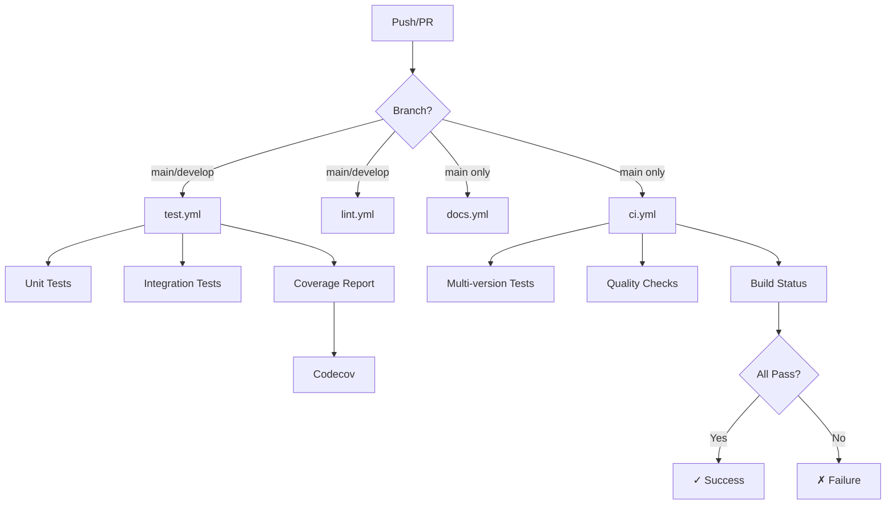

# GitHub Actions Workflows

This directory contains CI/CD workflows for the RAG pipeline project.

## Available Workflows

### 1. `test.yml` - Main Test Pipeline
**Trigger**: Push or PR to `main` or `develop` branches

**Steps**:
- ✅ Install dependencies with `uv`
- ✅ Run unit tests
- ✅ Run integration tests
- ✅ Generate coverage report
- ✅ Upload coverage to Codecov

**Usage**:
```bash
# This runs automatically on push/PR
# To test locally, run:
uv run pytest tests/ -v --cov=src/rag-pipeline
```

### 2. `lint.yml` - Code Quality Checks
**Trigger**: Push or PR to `main` or `develop` branches

**Steps**:
- ✅ Check Python syntax
- ✅ Check import sorting (optional)
- ✅ Check code formatting (optional)

**Usage**:
```bash
# To check locally:
python -m py_compile src/rag-pipeline/**/*.py

# Optional formatting:
uv pip install black isort
uv run black --check src/rag-pipeline/ tests/
uv run isort --check-only src/rag-pipeline/ tests/
```

### 3. `docs.yml` - Documentation Checks
**Trigger**: Push to `main` for markdown files

**Steps**:
- ✅ Check markdown links
- ✅ Verify key documentation files exist
- ✅ Generate documentation statistics

**Usage**:
```bash
# Check locally:
find . -name '*.md'
```

### 4. `ci.yml` - Complete CI/CD Pipeline
**Trigger**: Push or PR to `main` branch

**Features**:
- ✅ Multi-version Python testing (3.11, 3.12)
- ✅ Dependency caching for faster builds
- ✅ Sequential job execution (test → quality → status)
- ✅ Build status summary

**Matrix Testing**:
- Python 3.11
- Python 3.12

## Workflow Configuration

### Required Secrets
None required for basic functionality. Optional:
- `CODECOV_TOKEN` - For Codecov integration (optional)

### Environment Variables
Workflows use default environment variables. Tests don't require API keys as they use mocks.

## Badges

Add these badges to your README:

```markdown


```

## Local Testing

Test workflows locally before pushing:

```bash
# Install dependencies
uv sync

# Run all tests
uv run pytest tests/ -v

# Run with coverage
uv run pytest tests/ --cov=src/rag-pipeline --cov-report=html

# Check code quality
python -m py_compile src/rag-pipeline/**/*.py
```

## Workflow Triggers

### `test.yml`
```yaml
on:
  push:
    branches: [ main, develop ]
  pull_request:
    branches: [ main, develop ]
```

### `lint.yml`
```yaml
on:
  push:
    branches: [ main, develop ]
  pull_request:
    branches: [ main, develop ]
```

### `docs.yml`
```yaml
on:
  push:
    branches: [ main ]
    paths:
      - 'docs/**'
      - '**.md'
```

### `ci.yml`
```yaml
on:
  push:
    branches: [ main ]
  pull_request:
    branches: [ main ]
```

## Customization

### Modify Python Versions
Edit `ci.yml`:
```yaml
strategy:
  matrix:
    python-version: ['3.11', '3.12']  # Add more versions
```

### Change Test Coverage Threshold
Add to `pyproject.toml`:
```toml
[tool.coverage.report]
fail_under = 80  # Fail if coverage below 80%
```

### Add More Linters
Edit `lint.yml`:
```yaml
- name: Run flake8
  run: |
    uv pip install flake8
    uv run flake8 src/rag-pipeline/ tests/
```

## Troubleshooting

### Workflow Fails on First Run
- Check Python version compatibility
- Ensure `pyproject.toml` has all dependencies
- Verify test files are valid

### Coverage Upload Fails
- Add `CODECOV_TOKEN` secret to repository settings
- Or remove coverage upload step if not needed

### Tests Pass Locally but Fail in CI
- Check environment variables
- Ensure all test dependencies are in `pyproject.toml`
- Look for path issues (absolute vs relative paths)

## Workflow Status

View workflow runs:
1. Go to your repository on GitHub
2. Click **Actions** tab
3. View status of recent runs

## Best Practices

✅ **Do**:
- Keep workflows simple and focused
- Use caching to speed up builds
- Run tests on multiple Python versions
- Add clear job names and step descriptions

❌ **Don't**:
- Add API keys or secrets to workflow files
- Run expensive operations on every commit
- Ignore workflow failures
- Skip testing before merging

## Workflow Diagram



## Next Steps

1. **Enable Workflows**: Push this `.github` folder to your repository
2. **View Results**: Check the Actions tab on GitHub
3. **Add Badges**: Update README with status badges
4. **Configure Secrets**: Add any required tokens
5. **Monitor**: Watch workflow runs and fix any failures

---

**Note**: All workflows use `uv` for dependency management, matching your local setup.

*Last updated: February 8, 2026*
