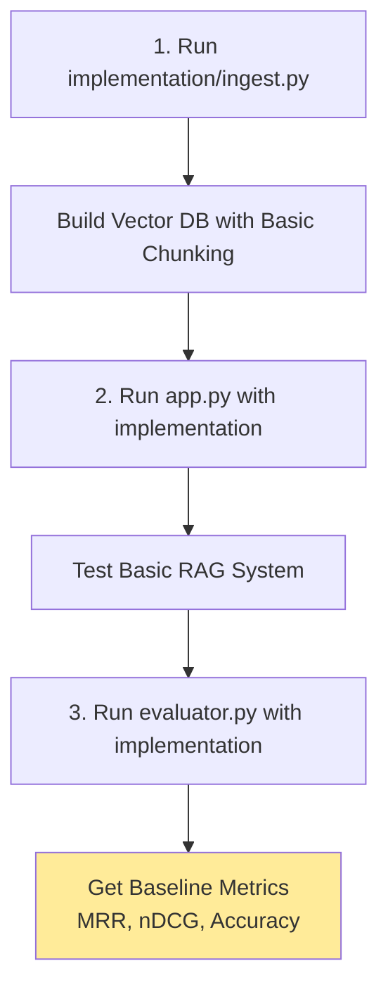
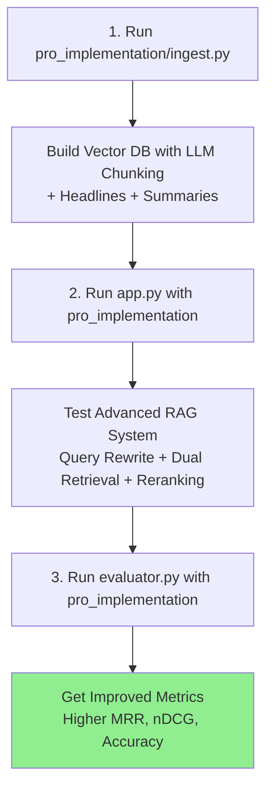

## Advanced RAG Pipeline 
Implementation & Evaluation

[](https://github.com/aditya-caltechie/ai-rag/actions)


This repository demonstrates the evolution from **Basic RAG** to **Advanced RAG** with comprehensive evaluation metrics.

## 🎯 Repository Overview

This project contains:
1. **Basic RAG Implementation** (`implementation/`) - Traditional RAG pipeline
2. **Advanced RAG Implementation** (`pro_implementation/`) - Enhanced with query rewriting, dual retrieval, and LLM reranking
3. **Evaluation Framework** - Measure retrieval quality (MRR, nDCG) and answer quality (LLM-as-judge)
4. **Comparative Analysis** - Documentation showing improvements from advanced techniques

## 📊 Project Workflow

### Phase 1: Basic RAG Implementation



**Baseline Results**: Establishes initial performance metrics (~75% retrieval, ~3.8/5 answer quality)

### Phase 2: Advanced RAG Implementation



**Expected Outcome**: 15-25% improvement in retrieval and answer quality (~92% retrieval, ~4.6/5 answer quality)

---

## 🏗️ Architecture Comparison

### Basic RAG Architecture

See detailed architecture: [Basic RAG Architecture](docs/2-basic_rag.md)

**Key Characteristics:**
- Simple rule-based chunking (500 chars, 200 overlap)
- Direct vector similarity search (K=10)
- Single query, no optimization
- Fast (1-2s) but less accurate (70-80%)

### Advanced RAG Architecture  

See detailed architecture: [Advanced RAG Architecture](docs/3-advanced_rag.md)

**Key Characteristics:**
- LLM-powered semantic chunking with metadata
- Query rewriting + dual retrieval (K=20 each)
- LLM reranking → top K=10
- Slower (3-5s) but more accurate (85-95%)

**Visual Comparison:**

| Phase | Basic RAG | Advanced RAG |
|-------|-----------|--------------|
| **Chunking** | Fixed character splits | LLM semantic splits + headlines |
| **Retrieval** | 1 query → similarity search | 2 queries (original + rewritten) |
| **Ranking** | Cosine similarity only | LLM semantic reranking |
| **Context** | Plain text chunks | Enhanced chunks with sources |
| **LLM Calls** | 1 (answer generation) | 4 (chunk, rewrite, rerank, answer) |
 

---

## 🚀 Quick Start

**For detailed step-by-step instructions, see the [Complete Workflow Guide](docs/8-workflow_guide.md)**

### Step 1: Setup Environment

```bash
# Install dependencies using uv
uv sync

# Configure API keys and RAG mode
cp .env.example .env
# Edit .env and add your API keys
# Set RAG_MODE=basic or RAG_MODE=pro
```

### Step 2: Run Basic RAG

```bash
cd src/rag-pipeline

# Set mode to basic in .env
# RAG_MODE=basic

# 1. Ingest documents (basic chunking)
uv run implementation/ingest.py

# 2. Launch UI (automatically uses mode from .env)
uv run app.py

# 3. Evaluate baseline
uv run evaluator.py
```

**📸 Screenshot your baseline metrics!**

### Step 3: Run Advanced RAG

```bash
# Set mode to pro in .env
# RAG_MODE=pro

# 1. Ingest with advanced chunking
uv run pro_implementation/ingest.py

# 2. Launch UI (automatically switches to pro mode)
uv run app.py

# 3. Evaluate improvements
uv run evaluator.py
```

**📸 Screenshot improved metrics and compare!**

**Expected Improvements:** 15-25% boost in MRR, nDCG, and answer quality scores.

### 🔄 Easy Mode Switching

No need to manually edit imports! Just change `RAG_MODE` in your `.env` file:
- `RAG_MODE=basic` → Uses `implementation/`
- `RAG_MODE=pro` → Uses `pro_implementation/`

See [Workflow Guide](docs/8-workflow_guide.md) for mode switching details.

---

## 📈 Key Improvements in Advanced RAG

| Technique | Implementation | Benefit |
|-----------|---------------|---------|
| **LLM Chunking** | GPT generates semantic chunks with headlines + summaries | Better retrieval accuracy |
| **Query Rewriting** | LLM refines user questions for better search | Surfaces more relevant docs |
| **Dual Retrieval** | Search with both original and rewritten queries | Catches missed documents |
| **LLM Reranking** | Semantic reordering of results | Top results are more relevant |
| **Parallel Processing** | Multiprocessing for ingestion | Faster indexing |

---

## 📊 Evaluation Metrics

### Retrieval Metrics
- **MRR (Mean Reciprocal Rank)**: How quickly correct docs appear
- **nDCG (Normalized DCG)**: Quality of ranking
- **Keyword Coverage**: Percentage of query terms in results

### Answer Quality Metrics (LLM-as-Judge, 1-5 scale)
- **Accuracy**: Factual correctness
- **Completeness**: Coverage of all aspects
- **Relevance**: How well it addresses the question

---

## 🔄 RAG Pipeline Fundamentals

RAG has two main phases that run at different times:

The typical flow for building and running a Retrieval-Augmented Generation (RAG) pipeline (local or cloud, using open-source tools like LangChain / LlamaIndex / Haystack / LangGraph + Mistral 7B or similar models).

- Offline / Indexing Pipeline (done once or periodically when data changes)
- Online / Query-Time Pipeline (runs every time a user asks something)

## 1. Indexing Pipeline (Data → Vector Store)
This prepares your knowledge base.
```
[Raw Data Sources]
   ↓
[1. Ingestion / Loading]
   ↓
[2. Pre-processing & Cleaning]
   ↓
[3. Chunking / Splitting]
   ↓
[4. Embedding Generation]
   ↓
[5. Metadata Enrichment (optional but very useful)]
   ↓
[6. Vector Store / Index Creation + Upsert]
```


## 2. Query-Time / Inference Pipeline (User Question → Answer)
   
```
User Question
   ↓
[1. Query Pre-processing (optional: rewrite / decompose)]
   ↓
[2. Query Embedding]  ← same embedding model as indexing
   ↓
[3. Retrieval]
      ├─→ Vector similarity search (top-k)
      ├─→ Optional: Hybrid (BM25 + vector)
      ├─→ Optional: Re-ranking (Cohere Rerank, bge-reranker, flashrank)
      └─→ Optional: Query transformation (HyDE, multi-query)
   ↓
[4. Context Assembly / Post-retrieval]
      ↓ (merge chunks, compress context if too long, add citations)
   ↓
[5. Prompt Construction]
      ↓ (system prompt + retrieved context + user question)
   ↓
[6. LLM Generation]  ← Mistral 7B, Llama-3.1 8B, Qwen 2.5, etc.
   ↓
[7. Optional: Post-processing]
      ↓ (guardrails, citation check, self-reflection / corrective RAG)
   ↓
Final Answer (+ sources / confidence)
```

## Quick Start Stack Recommendation (2026, local GPU, Mistral 7B)

- Framework → LlamaIndex or LangChain + LangGraph (for more advanced flows)
- Embedding → bge-m3 or snowflake-arctic-embed-m (fast & good quality)
- Vector DB → Chroma or Qdrant (persistent mode)
- LLM → Mistral-7B-Instruct-v0.3 (or Nemo 12B / Llama-3.2 3B for faster speed)
- Reranker (strongly recommended) → bge-reranker-large or flashrank
- Local inference → Ollama / vLLM / llama.cpp

## Advanced Additions (Production 2026)

- Parent-document retrieval / hierarchical indexing
- Self-RAG / Corrective RAG / Adaptive RAG
- GraphRAG (entities + knowledge graph)
- Agentic flows (query routing, fallback to web search)
- Evaluation loop (RAGAS, TruLens, DeepEval)

## Aditional reference repo
- https://github.com/aditya-caltechie/ai-langchain-intro
