# Basic RAG Architecture

```mermaid
graph TB
    subgraph "INGESTION PHASE (implementation/ingest.py)"
        A[📄 Load Documents<br/>Markdown Files] --> B[✂️ Text Chunking<br/>RecursiveCharacterTextSplitter<br/>chunk_size=500, overlap=200]
        B --> C[🧮 Generate Embeddings<br/>OpenAI text-embedding-3-large]
        C --> D[💾 Store in ChromaDB<br/>vector_db/]
    end
    
    subgraph "QUERY PHASE (implementation/answer.py)"
        E[👤 User Question] --> F[📝 Combine with History<br/>Concatenate prior messages]
        F --> G[🔍 Vector Search<br/>Similarity: cosine<br/>Top K=10]
        D -.->|Retrieve| G
        G --> H[📋 Format Context<br/>Plain text chunks]
        H --> I[🤖 LLM Generation<br/>GPT-4.1-nano<br/>temperature=0]
        I --> J[✅ Answer + Sources]
    end
    
    style A fill:#e3f2fd
    style D fill:#fff3e0
    style E fill:#e8f5e9
    style J fill:#c8e6c9
    style G fill:#fce4ec
```

## Flow Characteristics

### Ingestion
- **Simple rule-based chunking**: Fixed character boundaries
- **Single-pass processing**: Sequential document processing
- **Plain text storage**: No enhancement or metadata enrichment

### Query
- **Direct retrieval**: Single query embedding → similarity search
- **No query optimization**: Uses raw user question
- **Simple ranking**: Pure cosine similarity ordering
- **Fast but less accurate**: Quick responses, may miss relevant context

### Performance
- ⚡ **Speed**: Very fast (1-2s per query)
- 💰 **Cost**: Low ($0.001 per query)
- 🎯 **Accuracy**: 70-80% retrieval quality
