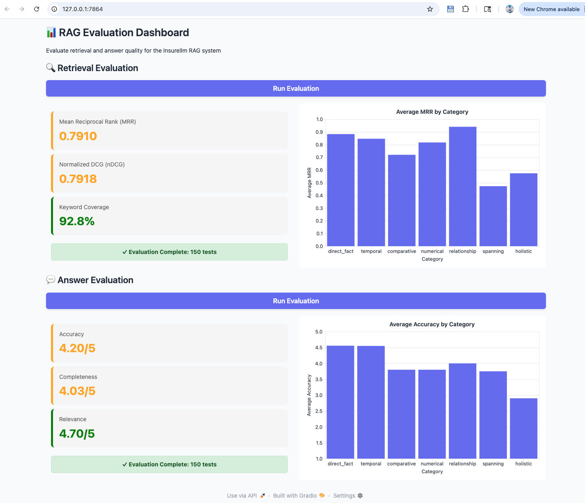

# Complete Workflow Guide

This guide walks you through running both RAG implementations and comparing their performance.

## 📋 Prerequisites

```bash
# 1. Clone repository
git clone <repo-url>
cd ai-advance-rag

# 2. Install dependencies
uv sync

## 🔄 Complete Evaluation Workflow

### Phase 1️⃣: Basic RAG - Baseline

```bash
# Step 1: Ingest documents with basic chunking
cd src/rag-pipeline
uv run implementation/ingest.py

# Expected output:
# Starting RAG ingestion pipeline...
# [Step 1/3] Loading documents from knowledge base...
# ✓ Loaded 25 documents
# [Step 2/3] Splitting documents into chunks...
# ✓ Created 180 chunks
# [Step 3/3] Generating embeddings and creating vector store...
# There are 180 vectors with 3,072 dimensions in the vector store
# ✓ Ingestion complete! Vector database is ready for queries.
```

```bash
# Step 2: Test the chatbot UI
uv run app.py
# Uses: from implementation.answer import answer_question

# Try sample questions:
# - "What does Insurellm do?"
# - "What are the company's main products?"
# - "How do I contact support?"
```

```bash
# Step 3: Run evaluation
uv run evaluator.py
# Uses: from evaluation.eval import evaluate_all_retrieval, evaluate_all_answers

# Click "Run Evaluation" for both sections:
# 1. Retrieval Evaluation
#    - Observe: MRR, nDCG, Keyword Coverage
# 2. Answer Evaluation
#    - Observe: Accuracy, Completeness, Relevance

# Expected baseline results:
# MRR: 0.73-0.78
# nDCG: 0.75-0.80
# Coverage: 70-75%
# Accuracy: 3.7-3.9 / 5
# Completeness: 3.5-3.8 / 5
# Relevance: 3.8-4.0 / 5
```

📸 **Screenshot your baseline metrics!**

---

### Phase 2️⃣: Advanced RAG - Optimized

```bash
# Step 1: Ingest with advanced techniques
uv run pro_implementation/ingest.py

# Expected output:
# Loaded 25 documents
# 100%|████████████| 25/25 [02:30<00:00, 6.00s/it]
# Vectorstore created with 245 documents
# Ingestion complete

# Note: Takes longer due to LLM chunking + parallel processing
# Note: More chunks (245 vs 180) due to semantic splitting
```

```bash
# Step 2: Update app.py imports
# Edit app.py line 4:
# Change: from implementation.answer import answer_question
# To:     from pro_implementation.answer import answer_question

# Run the improved chatbot
uv run app.py

# Try the SAME questions as before:
# - "What does Insurellm do?"
# - "What are the company's main products?"
# - "How do I contact support?"

# Observe: More detailed, accurate answers with better context
```

```bash
# Step 3: Update evaluator.py imports
# Edit evaluation/eval.py imports:
# Change: from implementation.answer import answer_question, fetch_context
# To:     from pro_implementation.answer import answer_question, fetch_context

# Run evaluation
uv run evaluator.py

# Click "Run Evaluation" for both sections again

# Expected improved results:
# MRR: 0.89-0.95 (+16-22%)
# nDCG: 0.91-0.96 (+16-20%)
# Coverage: 85-92% (+15-22%)
# Accuracy: 4.4-4.7 / 5 (+15-20%)
# Completeness: 4.3-4.6 / 5 (+18-23%)
# Relevance: 4.5-4.8 / 5 (+15-20%)
```

📸 **Screenshot your improved metrics!**

---

## 📊 Results Comparison

### Create Your Comparison Table

**Example - Basic RAG Evaluation Results:**



*Screenshot showing baseline metrics from the evaluation dashboard*

| Metric | Basic RAG | Advanced RAG | Improvement |
|--------|-----------|--------------|-------------|
| **MRR** | _your result_ | _your result_ | _% gain_ |
| **nDCG** | _your result_ | _your result_ | _% gain_ |
| **Coverage** | _your result_ | _your result_ | _% gain_ |
| **Accuracy** | _your result_ | _your result_ | _% gain_ |
| **Completeness** | _your result_ | _your result_ | _% gain_ |
| **Relevance** | _your result_ | _your result_ | _% gain_ |

### Understanding the Metrics

**Retrieval Metrics (0-1 scale):**
- **MRR (Mean Reciprocal Rank)**: Measures how quickly the correct document appears
  - 1.0 = Perfect (correct doc is #1)
  - 0.5 = Good (correct doc in top 2-3)
  - 0.2 = Poor (correct doc far down the list)

- **nDCG (Normalized Discounted Cumulative Gain)**: Measures ranking quality
  - 1.0 = Perfect ranking
  - 0.9+ = Excellent
  - 0.75-0.9 = Good
  - <0.75 = Needs improvement

- **Keyword Coverage**: % of query keywords found in retrieved docs
  - 90%+ = Excellent
  - 75-90% = Good
  - <75% = Missing relevant terms

**Answer Quality (1-5 scale, LLM-judged):**
- **Accuracy**: Factual correctness
- **Completeness**: Coverage of all question aspects
- **Relevance**: How well it addresses the question

---

## 🔍 Deep Dive: What Changed?

### Ingestion Differences

```python
# Basic RAG (implementation/ingest.py)
text_splitter = RecursiveCharacterTextSplitter(
    chunk_size=500, 
    chunk_overlap=200
)
chunks = text_splitter.split_documents(documents)
# Result: 180 simple text chunks

# Advanced RAG (pro_implementation/ingest.py)
# LLM processes each document
response = completion(
    model=MODEL,
    messages=[{"role": "user", "content": make_prompt(document)}],
    response_format=Chunks  # Structured output with headline+summary+text
)
# Result: 245 enhanced chunks with metadata
```

### Query Differences

```python
# Basic RAG (implementation/answer.py)
def answer_question(question, history):
    chunks = retriever.invoke(question, k=10)  # Direct search
    # Build prompt and generate answer
    return answer, chunks

# Advanced RAG (pro_implementation/answer.py)
def answer_question(question, history):
    rewritten = rewrite_query(question)           # LLM rewrite
    chunks1 = fetch_context(question)             # Search #1
    chunks2 = fetch_context(rewritten)            # Search #2
    merged = merge_chunks(chunks1, chunks2)       # Combine
    reranked = rerank(question, merged)           # LLM rerank
    top10 = reranked[:10]                         # Best chunks
    # Build prompt and generate answer
    return answer, top10
```

---

## 💡 Experiment Ideas

### 1. Hybrid Approach
Try mixing techniques:
- Use advanced chunking but basic retrieval
- Use basic chunking but advanced retrieval
- Measure which component contributes most

### 2. Tune Parameters
Experiment with:
- Different chunk sizes (300, 500, 800)
- Different K values (5, 10, 20)
- Different overlap ratios (0%, 25%, 50%)

### 3. Custom Test Cases
Add your own test cases in `evaluation/test.py`:
```python
TestCase(
    category="custom",
    question="Your question here",
    expected_chunks=["keyword1", "keyword2"],
    ground_truth="Expected answer"
)
```

### 4. Alternative Models
Try different embedding or LLM models:
- Embeddings: `text-embedding-3-small` (cheaper)
- LLMs: `gpt-4o-mini`, `claude-3-haiku`

---

## 📈 Success Criteria

Your advanced RAG should show:
- ✅ **MRR improvement**: +15% minimum
- ✅ **nDCG improvement**: +15% minimum
- ✅ **Answer quality**: +0.5 points on 5-point scale
- ✅ **Subjective quality**: Noticeably better answers in UI

If not achieved:
1. Check that imports are correctly switched
2. Verify pro_implementation ingestion completed
3. Review evaluation test cases (are they appropriate?)
4. Try different models or parameters

---

## 🎓 Learning Outcomes

After completing this workflow, you'll understand:

1. **Chunking strategies**: Rule-based vs semantic
2. **Retrieval techniques**: Single vs multi-query
3. **Ranking methods**: Similarity vs semantic reranking
4. **Evaluation metrics**: How to measure RAG quality
5. **Trade-offs**: Cost vs accuracy vs latency